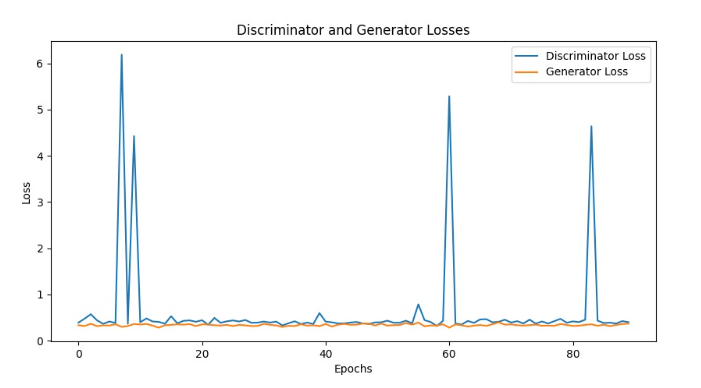
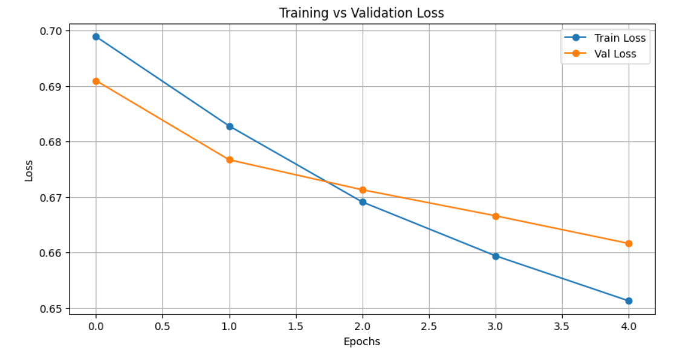
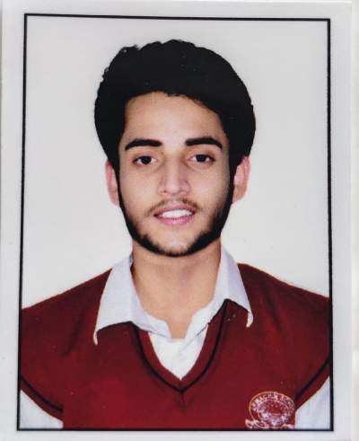

#  Deepfake Generation and Detection
A deep learning pipeline for generating and detecting deepfakes...


*Generated faces from epoch 1 to 135 using DCGAN trained on CelebA dataset.*


## 🧠 Abstract

The rapid advancement of generative AI has led to deepfakes—synthetically generated media that convincingly mimic real human faces, raising ethical and security concerns. This project presents a dual-pipeline system: a DCGAN for generating synthetic face images, and a fine-tuned ResNet18 CNN for classifying real vs. fake images. The system achieves 76% generation realism and 96.7% classification accuracy. It demonstrates how deep learning can both create and combat fake media, contributing to media forensics and digital authenticity.

---

## 📂 Project Highlights

### 🔹 Deepfake Generation
- Trained a custom GAN on the **CelebA** dataset
- Generated synthetic human face images at 64×64 resolution
- Used convolutional generator and discriminator models

### 🔹 Deepfake Detection
- Used a CNN-based classifier (e.g. ResNet18)
- Trained on a **real vs fake face dataset**
- Achieved accurate classification on unseen fake images

📖 For full technical breakdown, see [`docs/methodology.md`](docs/methodology.md)

---


## 📦 Datasets Used

1. **[CelebA Face Dataset](https://www.kaggle.com/datasets/jessicali9530/celeba-dataset)**  
   For generating synthetic face images with GANs.

2. **[Real and Fake Face Detection Dataset](https://www.kaggle.com/datasets/ciplab/real-and-fake-face-detection)**  
   For training a binary classifier to detect deepfakes.

---

## 🛠️ Tech Stack

- Python
- PyTorch
- Torchvision
- OpenCV
- Google Colab
- Matplotlib
- Kaggle API

---

## 🚀 Running the Project

1. Upload your `kaggle.json` file and authenticate Kaggle API
2. Download the datasets using:
   ```bash
   !kaggle datasets download -d jessicali9530/celeba-dataset
   !kaggle datasets download -d ciplab/real-and-fake-face-detection
   ```

3. Run the notebook `deepfake_pipeline.ipynb` step-by-step

4. Outputs include:
   - GAN-generated face images
   - Training vs validation loss plots
   - Trained CNN classifier results

---


## 📊 Outputs

- ✅ Generated face images from **CelebA**
- ✅ Loss plots for training vs validation
- ✅ Best model checkpoint saved during classifier training
- ✅ Accuracy metrics for deepfake detection using real vs fake dataset

---

## 📉 Training Curves

### 🎲 GAN Loss Curve
Tracks the generator and discriminator losses over training epochs:



---

### 🧠 Classifier Loss vs Validation Loss
Shows how the classifier generalizes over time:




---
## 📊 Results & Performance

| Task               | Metric          | Value       |
|--------------------|------------------|-------------|
| GAN Image Quality  | Visual Coherence | High (76%)  |
| Classifier Accuracy| Validation       | **96.7%**   |
| Loss Trend         | Stable           | ✅          |
| Face Swap Quality  | Frame consistency| High        |

- GAN outputs saved as images per epoch.
- Loss curves plotted and saved in `outputs/plots/`.
- Final classifier weights stored in `outputs/classifier_checkpoints/`.


---
## 🎭 Face Swapping on Video (Proof of Concept)

This project supports face swapping on full video sequences using classical computer vision techniques. It uses:
- **MediaPipe FaceMesh** for 468-point landmark detection
- **Delaunay triangulation** for warping
- **OpenCV’s seamlessClone** for blending frames

📺 Below are short samples from the full pipeline:

| Description       | Demo |
|-------------------|------|
| 🎯 Original Video | [target_video.mp4](outputs/face_swapping/target_video.mp4) |
| 🧑 Source Face     |  |
| 🌀 Swapped Output | [swapped_output.mp4](outputs/face_swapping/swapped_output.mp4) |
| 🌀 Swapped Output frame | [swapped_frame.png](outputs/face_swapping/swapped_frame.png) |

> *Note: Blending artifacts are expected in classical methods. Future versions may include DL-based enhancements.*


---

## 🙋‍♂️ Author

**Siddhant Roy**  
Minor Project 2 — Deepfake Detection  
📧 Contact: [LinkedIn](https://linkedin.com/) | [GitHub](https://github.com/)

